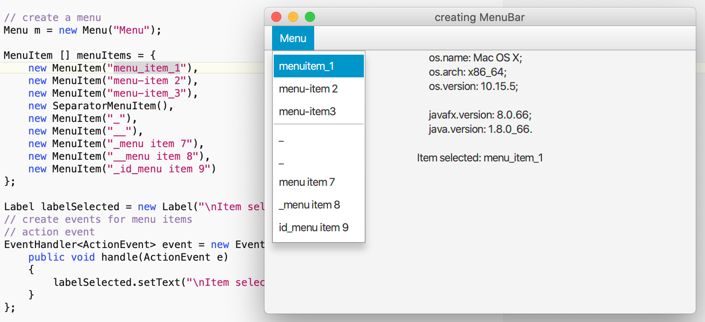
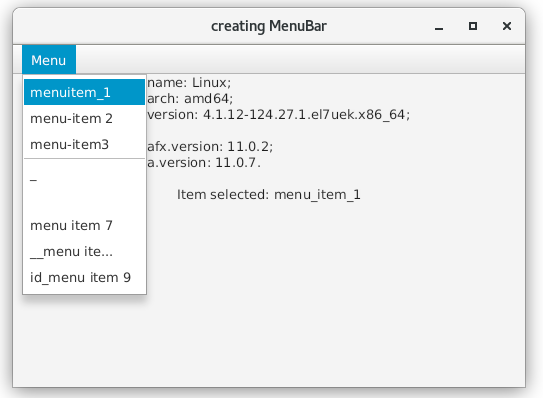

# jfx-menuitem-problem

Test showing the `underscore` problem in `javafx.scene.control.MenuItem`

Version:
* macOS:
	* `macOS Catalina 10.15.5`
	* `Java 1.8.0_66, JavaFX 8.0.66`
* Linux:
	* `Oracle Linux Server 7.6`
	* `Java 11.07, JavaFX 11.0.2`

On `macOS`:

On `Linux`:

